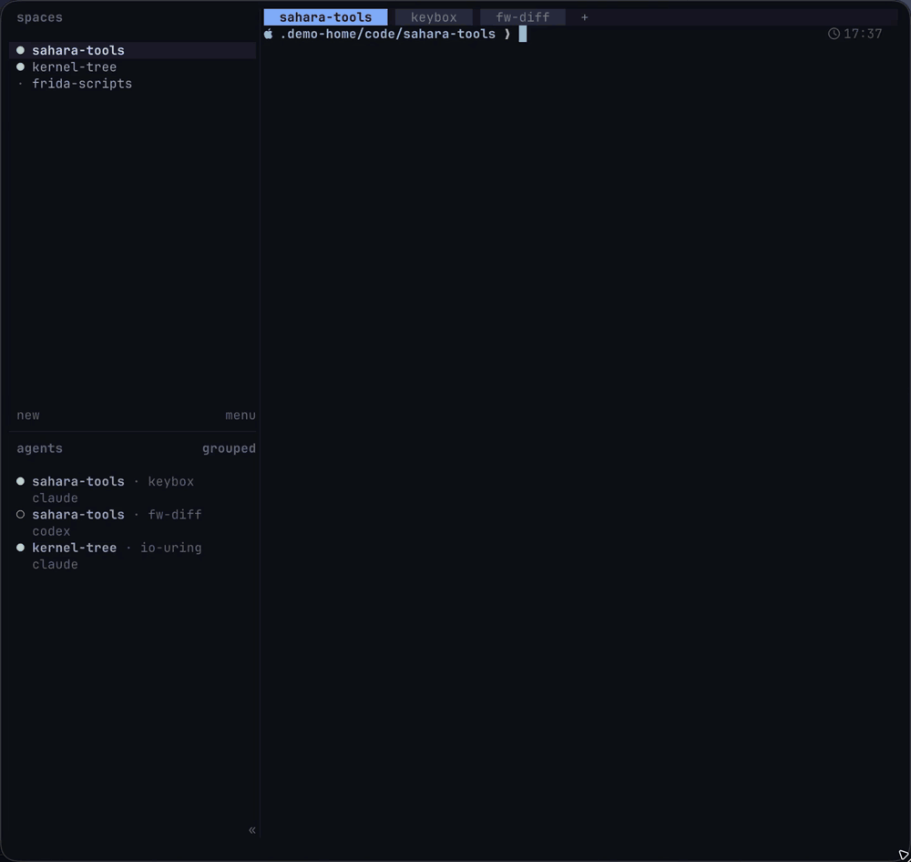
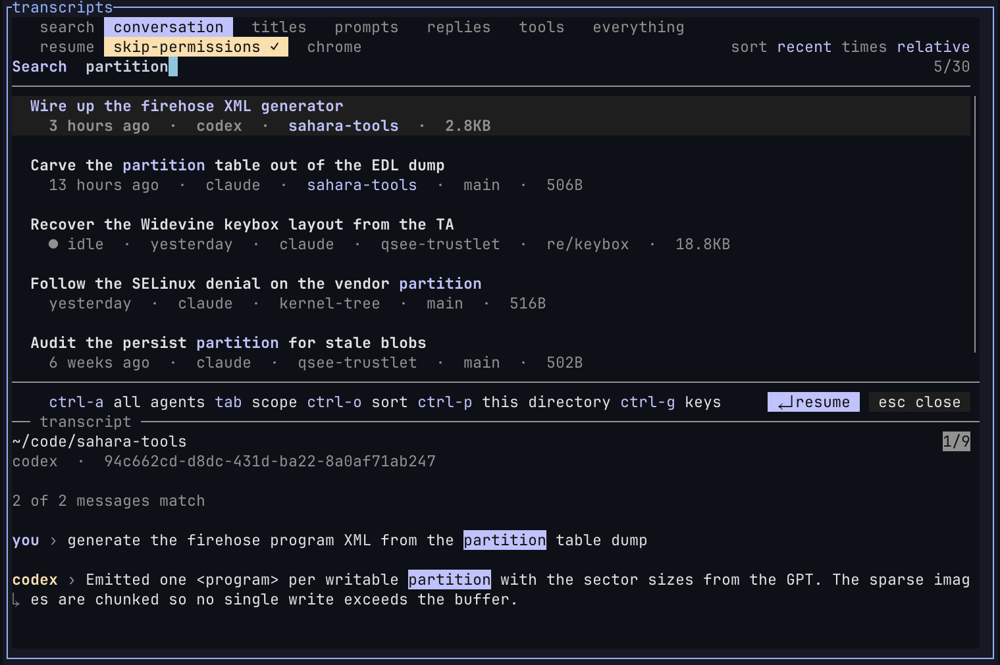
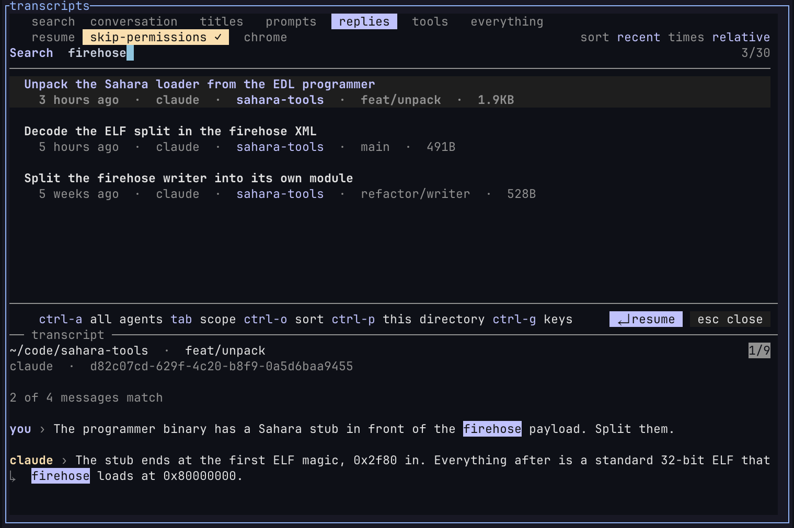
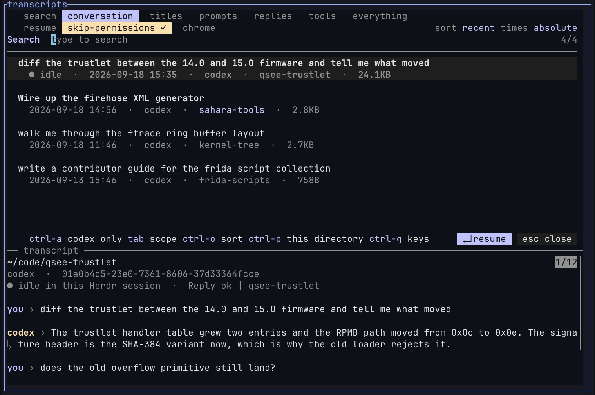
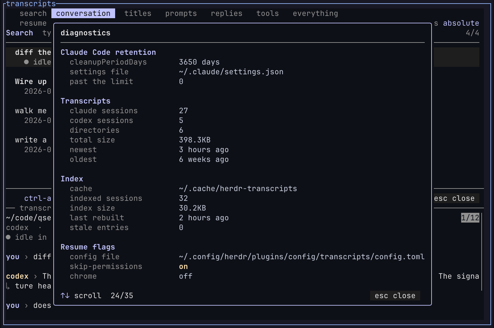

# herdr-transcripts

Search your coding-agent sessions, past and live, by any word you remember,
then jump to them or resume them in a [Herdr](https://herdr.dev) tab. Search
by title, prompt, reply or tool call.

[](assets/overview.mp4)

## Features

- Covers the main coding agents in one list
- Search words across titles, prompts, replies and tool calls
- Highlighted matches in previews
- Scores a session against your tree: what it touched, what survived
- Mouse-first like Herdr, with a key for everything
- Filters by agent and cwd
- Incremental index, pre-warmed, parallel parsing: a cold rebuild of 3.8 GiB
  takes under a second, a warm list about 0.2 s
- Python standard library and `fzf`

## Supported agents

[Claude Code](https://docs.anthropic.com/en/docs/claude-code),
[Codex](https://github.com/openai/codex),
[OpenCode](https://opencode.ai),
[Gemini CLI](https://github.com/google-gemini/gemini-cli),
[Droid](https://factory.ai),
[Copilot CLI](https://github.com/github/copilot-cli),
[Kimi Code](https://github.com/MoonshotAI/kimi-cli) and
[Qwen Code](https://github.com/QwenLM/qwen-code).

`Ctrl+X` toggles each agent's own skip-permissions flag, `--yolo`,
`--allow-all-tools` or `--auto high` as the agent spells it. `Ctrl+D` shows
where each agent's transcripts are read from and the exact resume command.

A session already running in Herdr shows a status chip, and `Enter` focuses it
instead of starting it again.

## Screenshots

**Searched by word across titles, prompts and replies**



**Scoped to replies, matching what the agent said**



**Scoped by agent with absolute dates**



**Diagnostics with retention, index state and flags**



## Requirements

- Linux or macOS
- Herdr ≥ 0.7
- `fzf` ≥ 0.66
- Python ≥ 3.8
- At least one supported agent, to resume sessions

> [!NOTE]
> Debian and Ubuntu package older `fzf` versions. Install a current
> [fzf release](https://github.com/junegunn/fzf/releases) if the picker reports
> an unsupported version.

## Install

```sh
herdr plugin install hxreborn/herdr-transcripts
```

Bind a key in `~/.config/herdr/config.toml`:

```toml
[[keys.command]]
key = "ctrl+alt+f"
type = "shell"
command = "\"$HERDR_BIN_PATH\" plugin pane open --plugin transcripts --entrypoint picker"
description = "Search session transcripts"
```

Reload Herdr:

```sh
herdr server reload-config
```

## Usage

Type a word. Matches are newest first. `Enter` resumes the session in its own
directory, or focuses its pane if it's already running.

`Tab` cycles the search scope:

| Scope          | Searches                                    |
| -------------- | ------------------------------------------- |
| `conversation` | titles, prompts, and replies                |
| `titles`       | session title, directory, and branch        |
| `prompts`      | your messages                               |
| `replies`      | the assistant's messages                    |
| `tools`        | commands, paths, and patterns in tool calls |
| `everything`   | every indexed field                         |

Words match exactly, in any order. Prefix a word with `'` for fuzzy matching
or `!` to exclude it. `^` and `$` anchor a word.

`Ctrl+A` narrows to one agent, `Ctrl+P` to the current directory, and `Ctrl+O`
changes the sort order.

`./transcripts` outside Herdr runs the picker in the current terminal.

## What a session left behind

The preview checks the files a session touched against your tree:

```
9 files touched  ·  7 still there  ·  1 superseded  ·  1 unexplained
```

*Superseded* means a commit recorded the deletion. *Unexplained* means it is gone
and git never recorded it going. One batched `git log` per preview, never per row,
and it degrades to there-and-gone outside a repository. Codex is read from the
paths its own patches report, so its line misses anything written by a plain
shell command.

## Keys

| Key                | Action                                   |
| ------------------ | ---------------------------------------- |
| `Enter`            | resume                                   |
| `Esc`              | close                                    |
| `Tab`              | next scope                               |
| `Ctrl+O`           | next sort order                          |
| `Ctrl+P`           | only this directory                      |
| `Ctrl+A`           | one agent, or all of them                |
| `Ctrl+T`           | relative or absolute time                |
| `Ctrl+V`, `Ctrl+/` | toggle the preview                       |
| `Ctrl+X`           | toggle the agent's skip-permissions flag |
| `Ctrl+B`           | toggle `--chrome` (Claude Code only)     |
| `Ctrl+G`           | keys overlay                             |
| `Ctrl+D`           | diagnostics                              |

## Configuration

The picker saves scope, sort, time format, agent filter, and resume flags in
`~/.config/herdr/plugins/config/transcripts/config.toml`.

Colours come from `[theme.custom]` in the Herdr config, at `HERDR_CONFIG_PATH`
when Herdr sets it and `~/.config/herdr/config.toml` otherwise.

## Diagnostics

`Ctrl+D` reports dependency versions, index state, session counts, active
flags, and Claude Code transcript retention. If `cleanupPeriodDays` is 30 or
lower, diagnostics offers to set it to 3,650 in `~/.claude/settings.json`.

The index lives in `~/.cache/herdr-transcripts`. Delete that directory, or run
`./transcripts warm`, to rebuild it.

## Development

```sh
tests/tui.py
herdr plugin link .
```

## Licence

[GPL-3.0-or-later](LICENSE)
